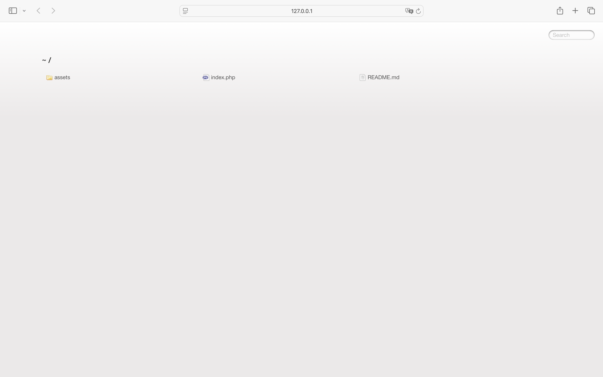
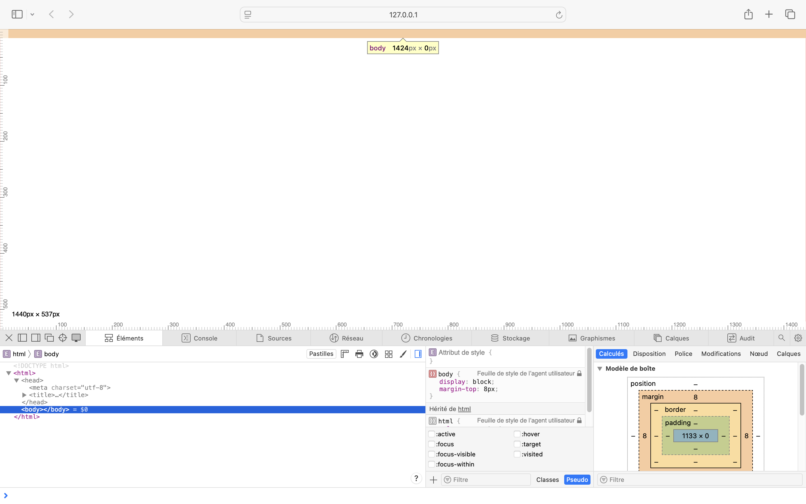
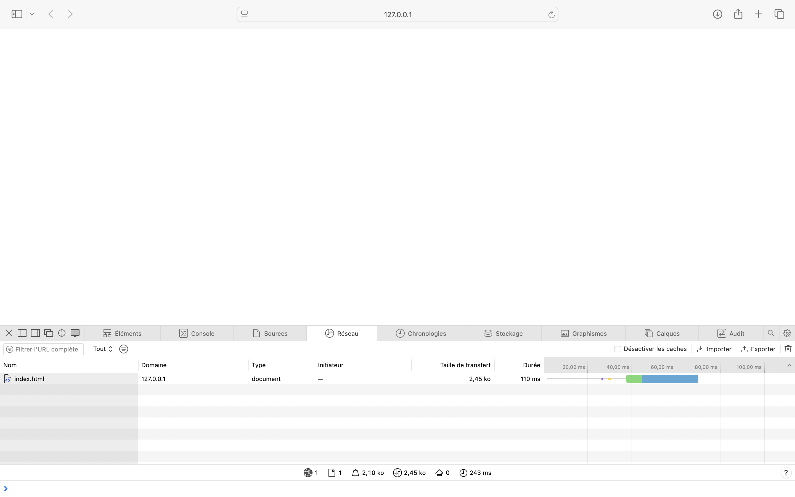
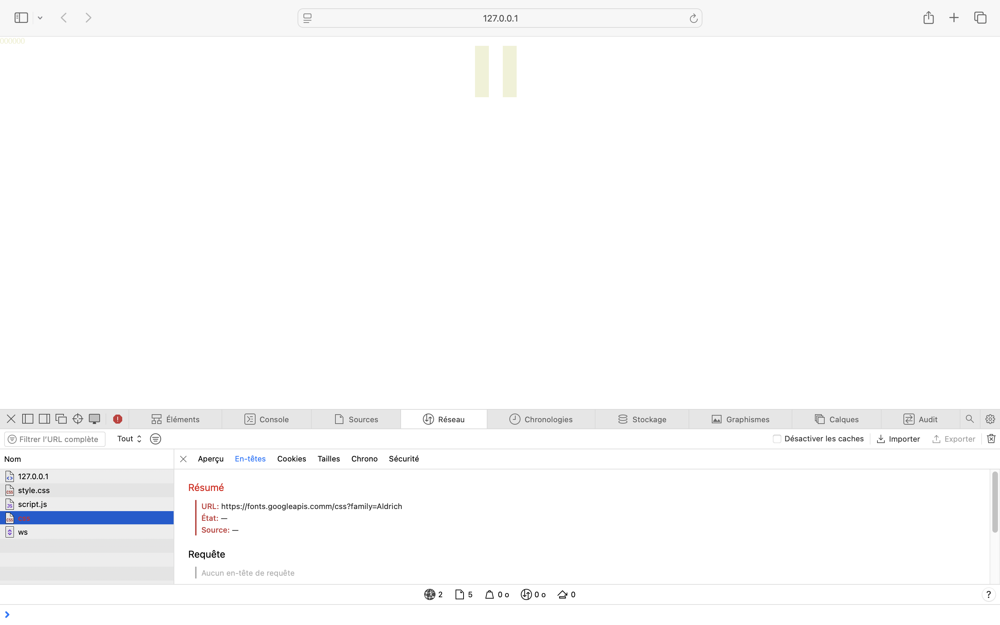
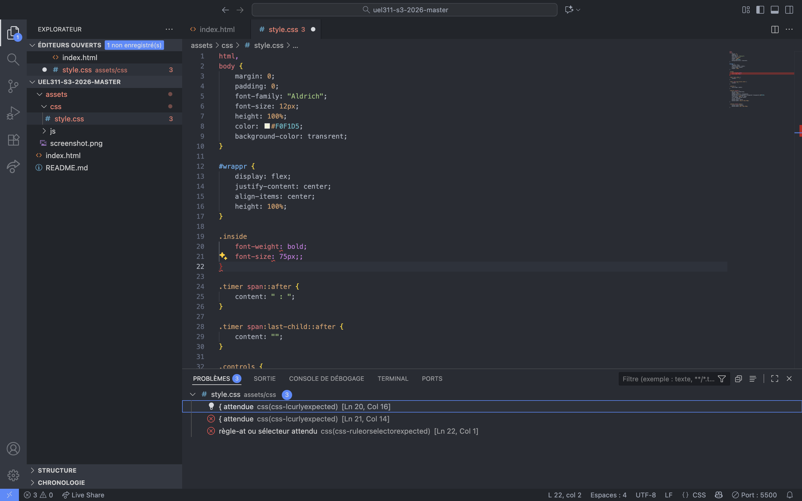
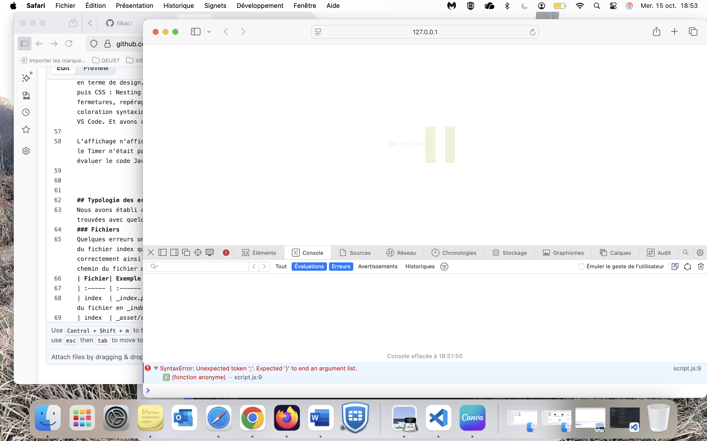

# Simple Time - UE L311 - Semaine 3 - Groupe G

## 📚 Sommaire

- 👥 [Membres du groupe](#membres-du-groupe)
- 🤝 [Travail collaboratif](#travail-collaboratif)
  - 🛠️ [Outils](#outils)
  - 📋 [Principe général](#principe-général)
- 🗓️ [Planning de la semaine](#planning-de-la-semaine)
- 🐞 [Méthodes de débogage employées](#méthodes-de-débogage-employées)
  - 📝 [Analyse du fichier HTML](#analyse-du-fichier-html)
  - 🔎 [Analyse du code source dans le navigateur](#analyse-du-code-source-dans-le-navigateur)
  - 📂 [Vérification des fichiers chargés](#vérification-des-fichiers-chargés)
  - 🎨 [Analyse et validation du HTML et du CSS](#analyse-et-validation-du-html-et-du-css)
  - 🖥️ [Debug du JavaScript via la console du navigateur](#debug-du-javascript-via-la-console-du-navigateur)
  - ✅ [Phase de test fonctionnel](#phase-de-test-fonctionnel)
- ⚡ [Typologie des erreurs](#typologie-des-erreurs)
  - 📄 [Fichiers](#fichiers)
  - ✏️ [Syntaxe](#syntaxe)
  - 🧩 [Structure](#structure)
  - 🧠 [Logique](#logique)
  - 🔗 [Interaction](#interaction)
  - 🖥️ [Affichage](#affichage)
  - 🧹 [Qualité du code](#qualité-du-code)
- 🧪 [Tests fonctionnels manuels](#tests-fonctionnels-manuels)

## Membres du groupe

| Etudiant.e  |  Alias      |    
| :----------:|:-----------:| 
| Mathilde C. | Clouddy23   | 
| Kamo G.     | Spaghette5  |   
| Mathieu L.  | mathleys    |   
| Filippos K. | filkat34    | 

## Travail collaboratif

### Outils
Le principal outil de collaboration utilisé est Github. Nous avons cloné le dépôt fourni et chaque membre de l'équipe a créé sa propre branche pour pouvoir travailler indépendamment. Nous avons également utilisé Teams pour faire les visios de code review.

### Principe général
La première code review nous a permis de repartir grossièrement le travail entre nous en ajoutant dans la rubrique "issues" de Github pour mémoire les bogues déjà repérés, commençant ainsi une liste appelée à être progressivement enrichie au fil de notre travail. 

Tout en se partageant la résolution des bogues listés et vu l'ampleur restreinte du projet et l'envie de certains de se préoccuper également d'accessibilité et de qualité de code, nous avons décidé de laisser libre cours à chacun de travailler sur sa branche et d'apporter les modifications qu'il juge nécessaires. Une fois son travail fini, chacun fait une demande de tirage pour que les autres puissent en prendre connaissance. 

Un travail d'harmonisation est prévu dans le cadre de la deuxième code review en visio où l'on discute des propositions de chacun, faisons des tests fonctionnels manuels dans chaque branche pour choisir et amender celle qui devra être fusionnée avec la branche principale.

## Planning de la semaine
| Dates |  Objectif  |    
| :---|:---| 
| 12/10 | **Code review n. 1** en visio : lecture collective du code et ouverture d'issues pour mémoire sur Github |
| 13/10-16/10 | **Période de débogage** en priorité des erreurs assignées au développeur dans sa branche _bugfix/nomdudev_ |   
| 17/10		  | **Code review n. 2** pour discussion autour des pull requests et merge dans main |   
| 18/10-19/10 | **Finalisation de la rédaction du CR** dans le README.md de la branche main | 

## Méthodes de débogage employées
Pour identifier et corriger les problèmes, plusieurs méthodes de debug ont été employées :

### Analyse du fichier HTML
À l’ouverture de l’application, le navigateur affichait uniquement l’arborescence des fichiers, au lieu de charger automatiquement le fichier _index.html_. Cette anomalie a été attribuée à une erreur dans l’extension du fichier.



### Analyse du code source dans le navigateur
L’inspection du HTML a permis de détecter que le contenu attendu entre les balises ```<body>``` n’était pas présent. Cette étape a mis en évidence des erreurs structurelles qui pouvaient perturber le rendu de la page.



### Vérification des fichiers chargés
L’inspection du réseau a montré que seul _index.html_ était chargé. Les appels au fichier CSS et à Google Fonts ont été contrôlés, révélant des fautes de frappe empêchant le chargement correct du design.




### Analyse et validation du HTML et du CSS
Les fichiers ont été examinés pour vérifier le nesting des éléments, la fermeture correcte des balises et la cohérence de la syntaxe. L’éditeur VS Code a été utilisé pour détecter automatiquement les erreurs de syntaxe, les fautes de frappe et les incohérences dans les fichiers.



### Debug du JavaScript via la console du navigateur
La console a signalé des erreurs : fonctions invalides, fautes de frappe, absence de fermetures et erreurs de type. Chaque erreur a été corrigée de manière ciblée, en suivant les messages de la console.



### Phase de test fonctionnel
Après correction, le rendu de la page et du design a été validé visuellement. L'horloge a été testée pour vérifier l’ensemble de ses fonctionnalités (voir [Tests fonctionnels manuels](#tests-fonctionnels-manuels)).

Grâce à cette méthodologie structurée, combinant inspection manuelle, outils de développement du navigateur et vérification automatique via l’éditeur, l’ensemble des anomalies a été identifié et corrigé, aboutissant à un affichage fonctionnel et conforme au design attendu.

## Typologie des erreurs
Nous avons établi ci-dessous une typologie des erreurs trouvées avec quelques exemples pour chacune d'entre elles.

### Fichiers
Quelques erreurs ont été trouvées concernant l'extension du fichier index qui l'empêchait de s'afficher correctement ainsi qu'une coquille dans la saisie du chemin du fichier des styles.
| Fichier| Exemple | Solution |
| :----- | :------ | :------  |
| index  | _index.php_	| Renommer l'extension incorrecte du fichier en _index.**html**_ |
| index	 | _asset/css/style.css_| Correction de la coquille dans le nom du dossier _asset**s**/css/style.css_ |
### Syntaxe
De nombreuses erreurs de syntaxe on été corrigées, qu'il s'agisse de coquilles typographiques, d'oublis de fermeture de balises et d'accolades ou des noms de fonctions javascript erronés.
| Fichier| Exemple | Solution |
| :----- | :------ | :------  |
| index  |_```<title>Timetitle>```_| Ajout de la balise fermante _```<title>Timetitle</title>```_ |
| styles |_```.inside font-weight: bold; font-size: 75px;;}```_| Ajout de l'accolade ouvrante et du point virgule en double. Corrigé en _```.inside { font-weight: bold; font-size: 75px; }```_|
| script |_```.setTimeInterval(function(){ ... }, 1000;```_| Ajout de la parenthèse fermante et correction du nom de la fonction Javascript _```setInterval(function(){ ... }, 1000);```_ |
### Structure


### Logique
### Interaction
### Affichage
### Qualité du code

## Tests fonctionnels manuels
| Fonctionnalité/Branche | Mathilde | Kamo | Mathieu | Filippos |   
| :---|:---:|:---:| :---:| :---:|
|Pas d’erreur JavaScript dans la console.|✅| |✅|✅|
|La page affiche l’heure, les minutes et les secondes à 00:00:00 au chargement.|✅| |✅|✅|
|Les séparateurs (:) sont visibles.|✅| |✅|✅|
|L’heure, les minutes et les secondes se mettent à jour chaque seconde.|✅| |✅|✅|
|La couleur du fond change progressivement en fonction de l’heure.|✅| |✅|✅|
|Cliquer sur le bouton met l'horloge en pause (l’heure n’avance plus).|✅| |✅|✅|
|Cliquer à nouveau sur le bouton relance l'horloge.|✅| |✅|✅|
|Le bouton affiche “pause” quand l'heure tourne et “play” quand elle ne tourne pas.|✅| |✅|✅|
|L'horloge reste lisible et centrée, sans débordement.|✅| |✅|✅|
|L'affichage de l'horloge s'adapte correctement sur de plus petits écrans (mobile, tablette).|✅| | |✅|
|Lorsque le bouton bascule entre play/pause, il ne pousse pas les autres éléments du DOM. | | | |✅|
